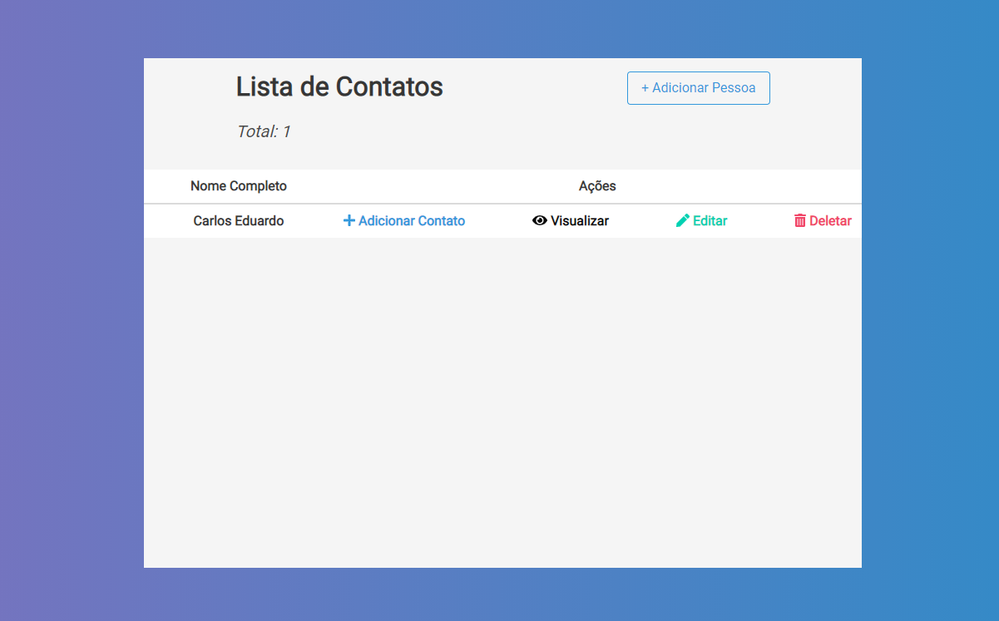
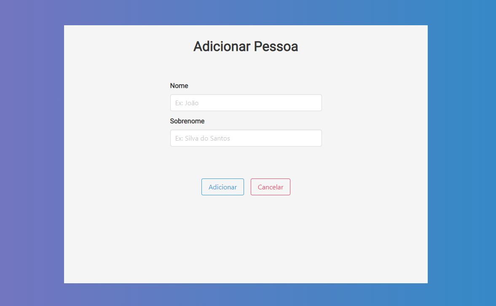
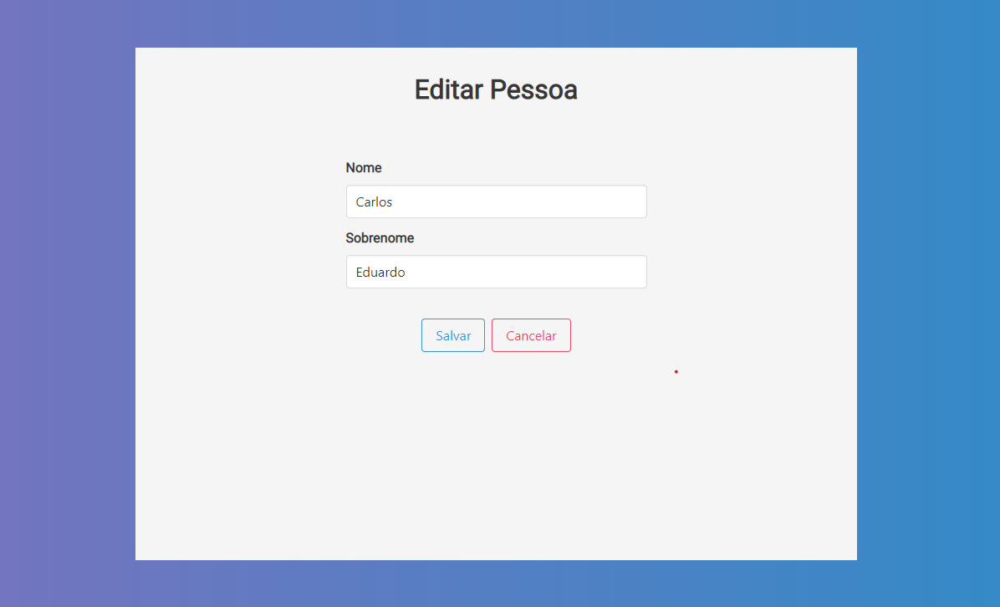
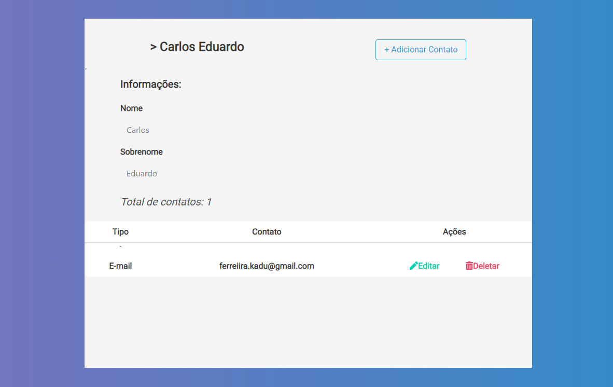
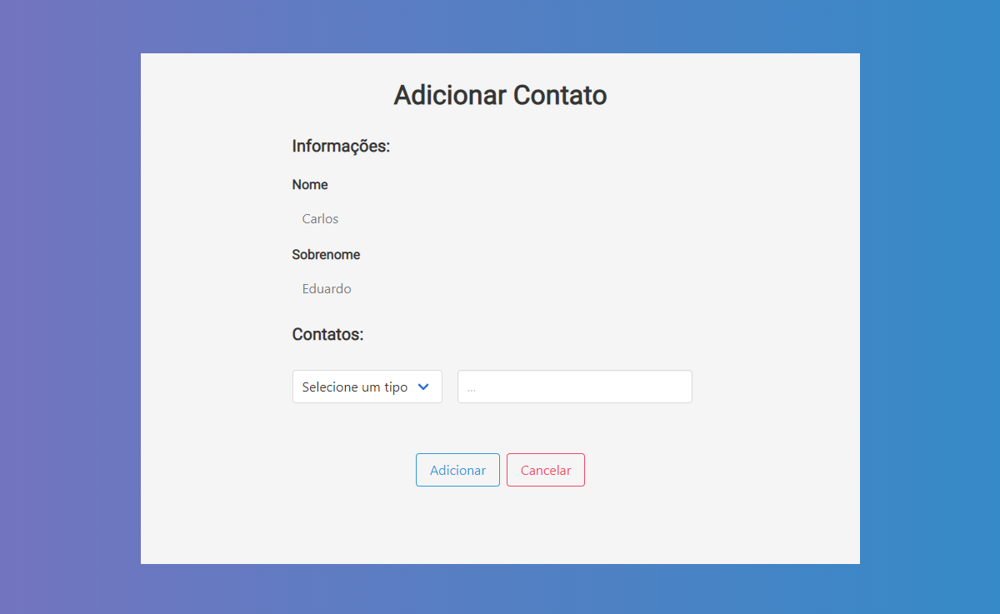
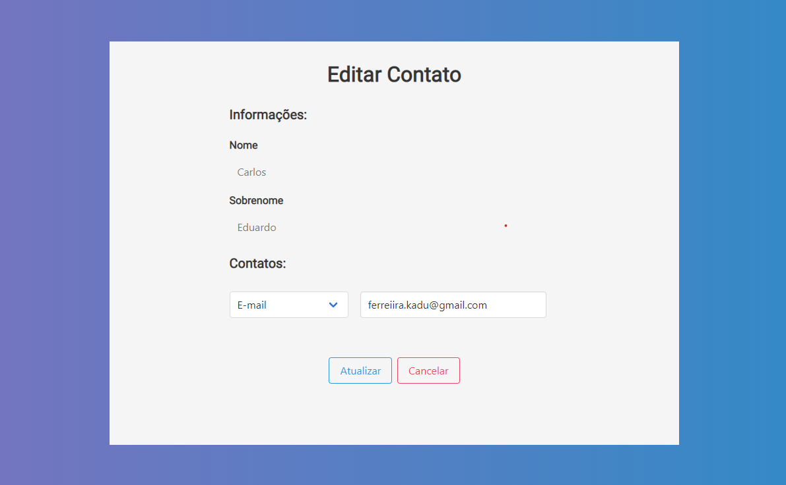

# Agenda - Front End

## Sobre

Essa aplicação é uma agenda, onde o usuario poderá cadastrar informações ( e-mail, telefone ) em um contato.

## Como usar

- ### **Pré-requisitos**

  - É **necessário** possuir o **[Node.js](https://nodejs.org/en/)** instalado na máquina
  - Também, é **preciso** ter um gerenciador de pacotes seja o **[NPM](https://www.npmjs.com/)** ou **[Yarn](https://yarnpkg.com/)**.

1. Faça um clone :

```sh
  $ git clone https://github.com/kaduufr/Prova-dev-CBMSE
```

2. Executando a Aplicação:

```sh
  # Acesse a pasta web
  $ cd web

  # Instale as dependências
  $ npm install

  # Inicie a aplicação
  $ npm start
```

## Paginas da Aplicação

- Pagina inicial

<h1 align="center">
    
</h1>

- Criar de pessoa
<h1 align="center">
    
</h1>
- Editar pessoa
<h1 align="center">
    
</h1>
- Mostrar pessoa e contatos
<h1 align="center">
    
</h1>
- Criar contato
<h1 align="center">
    
</h1>
- Editar contato
<h1 align="center">
    
</h1>

### **Informações**

 - A navegação dentro do aplicato é bem simples e direta.
 - Ação de deletar precisa de confirmação tanto para excluir uma pessoa, como um contato.

